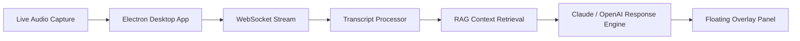

<!-- ============================================================ -->
<!--                        HERO BANNER                          -->
<!-- ============================================================ -->
<p align="center">
  
</p>

<p align="center">
  
</p>

<p align="center">
  <a href="https://linkedin.com/in/omkar-bhosale-sde"></a>
  <a href="mailto:harrybhosale17@gmail.com"></a>
  <a href="https://github.com/omey-bhosale"></a>
  
</p>

<p align="center">
  
  
  
  
</p>

---

## 🧭 About Me

> Software Engineer II with ~4 years building scalable, reliable server-side systems on a microservices architecture across **cybersecurity** and **industrial automation**. I design backend platforms in Java and Spring Boot and have shipped **production features built directly on LLM APIs** — Anthropic Claude, OpenAI, and Amazon Bedrock — including RAG and prompt-engineering pipelines that integrate AI into real engineering workflows. I own systems end to end, set engineering standards, and mentor engineers on cloud-native and production-debugging patterns.

```yaml
name: Omkar Bhosale
role: Software Engineer II
company: Rapid7 (InsightVM, Exposure Analytics)
based_in: Pune, India
focus:
  - Backend Platform Engineering (Java / Spring Boot)
  - Distributed & Event-Driven Systems (Kafka)
  - Cloud-Native Infrastructure (AWS, Docker, Kubernetes)
  - LLM-Integrated Backend Systems (Claude, OpenAI, Bedrock, RAG)
  - Production Reliability & Incident Response
```

---

## ⚡ What I Build

<table>
<tr>
<td width="50%" valign="top">

### 🏗️ Backend Platforms
- Java / Spring Boot microservices
- REST APIs & OpenAPI contracts
- Shared platform libraries & abstractions
- Spring Data JPA, Quarkus, Apache Camel
- End-to-end service ownership

</td>
<td width="50%" valign="top">

### ☁️ Cloud & Distributed Systems
- AWS (S3, SQS, SNS, RDS)
- Kafka-based event-driven architecture
- Docker & Kubernetes orchestration
- CI/CD via Jenkins & Spinnaker
- Multi-environment deployment safety

</td>
</tr>
<tr>
<td width="50%" valign="top">

### 🤖 AI & LLM Integration
- Amazon Bedrock + Anthropic Claude
- OpenAI API integration
- RAG pipelines & similarity-based retrieval
- Prompt engineering for verification workflows
- AI-assisted test generation

</td>
<td width="50%" valign="top">

### 🔍 Production Engineering
- CloudWatch, OpenSearch, Trino
- PagerDuty incident response & RCA
- SLA-driven fixes on live systems
- Architecture & design reviews
- Mentoring on cloud-native patterns

</td>
</tr>
</table>

---

## 🛠️ Tech Arsenal

<p align="center">
  
</p>

**Languages & Core**
<p align="left">
  
  
  
  
</p>

**Backend & APIs**
<p align="left">
  
  
  
  
  
  
</p>

**Cloud & Infrastructure**
<p align="left">
  
  
  
  
  
</p>

**AI & LLM Integration**
<p align="left">
  
  
  
  
  
  
</p>

**Data, Testing & Observability**
<p align="left">
  
  
  
  
  
  
  
</p>

---

## 💼 Professional Experience

### 🔐 Rapid7 — Software Engineer II
**Sep 2025 – Present · Pune, India · InsightVM, Exposure Analytics**

- Built production engineering systems on **Amazon Bedrock + Anthropic Claude** to validate migration correctness and generate migration-aware unit/integration tests — applying prompt engineering and retrieval over internal code and docs to cut manual verification during a large AWS SDK cutover.
- Migrated **5+ backend services and 3 shared libraries** off AWS SDK v1, building a centralized abstraction layer for S3, SQS, and SNS that isolated cloud access from business logic across the InsightVM microservices mesh.
- Designed shared platform libraries standardizing AWS client setup, retry policy, and credential handling — adopted org-wide as a tested integration pattern.
- Owned production incidents end to end, tracing root cause through CloudWatch, OpenSearch, and Trino, shipping fixes within SLA against PagerDuty runbooks.
- Delivered releases via Jenkins, Spinnaker, and Docker onto Kubernetes across multiple environments.
- Contributed to architecture reviews, cross-team PR reviews, and mentored junior engineers.

`Java` `Spring Boot` `AWS SDK v2` `Bedrock` `Claude` `Kubernetes` `Spinnaker`

---

### 🏭 Rockwell Automation — Software Engineer
**Jul 2023 – Sep 2025 · Pune, India · FactoryTalk DataMosaix, Converged Data Services**

- Built event-driven microservices with **Kafka and Camel-K**, decoupling upstream data producers from downstream analytics consumers and containing failures to a single domain.
- Built a **data virtualization layer** using Apache Calcite over a virtual PostgreSQL endpoint, enabling SQL-based querying across heterogeneous data sources without moving data.
- Prototyped cross-domain data federation on **Quarkus**; the POC was adopted as the blueprint for the platform's data access strategy.
- Defined OpenAPI-based REST contracts and reworked query execution paths, cutting latency on analytics-heavy endpoints.
- Built reusable Angular components for FactoryTalk Design Studio, holding **80%+** unit/integration coverage.

`Kafka` `Apache Calcite` `Quarkus` `PostgreSQL` `Angular` `Camel-K`

---

### 🧩 SDK Infotech Pvt. Ltd. — Associate Software Engineer
**Jun 2022 – Jul 2023 · Pune, India**

- Built Spring Boot backend modules and REST APIs (Java 8) for enterprise web applications.
- Integrated backend services with Angular frontends over MySQL, implementing data sync and session management.
- Established core engineering fundamentals — REST design, JUnit coverage, code review, Agile delivery.

`Java 8` `Spring Boot` `Angular` `MySQL`

---

## 🌟 Flagship Project

### 🚀 ContextPilot — AI Meeting Intelligence Platform
*Personal · Electron · React · TypeScript · WebSockets · RAG · Anthropic Claude / OpenAI*

> A real-time desktop intelligence layer that captures live audio, transcribes speech, and surfaces contextual AI-generated insights through a floating overlay — an end-to-end, production-style example of LLM API integration.



**Highlights**
- Real-time audio capture and transcription over WebSockets
- RAG pipeline with retrieval, similarity-based context selection, and prompt construction
- Dynamic summary generation and contextual insight surfacing
- Floating overlay UI built for live, low-friction assistance
- Built as a personal lab for production-grade LLM API integration

<p align="left">
  
  
  
  
  
</p>

---

## 📌 Currently Exploring

<p align="left">
  
  
  
  
  
  
  
  
</p>

---

## 📊 GitHub Analytics

<p align="center">
  
  
</p>

<p align="center">
  
</p>

<p align="center">
  
</p>

<details>
<summary>🏆 GitHub Trophies</summary>
<p align="center">
  
</p>
</details>

---

## 🎓 Education & Certifications

| | |
|---|---|
| 🎓 **B.Tech, Computer Engineering** | Savitribai Phule Pune University · CGPA 9.21/10 · 2023 |
| 🎓 **Diploma, Information Technology** | MSBTE · 91.81% · 2020 |
| 📜 **Microsoft Technology Associate** | Database Administration (MTA) |
| 🔄 **In Progress** | AWS Certified Solutions Architect – Associate (SAA-C03) |

---

## 🧭 Engineering Principles

```text
Build systems that are simple to operate.
Write code that survives production.
Prefer clear abstractions over clever shortcuts.
Automate repeatable engineering work.
Use AI where it improves developer productivity, not where it adds noise.
```

---

## 🤝 Let's Connect

<p align="center">
  <a href="mailto:harrybhosale17@gmail.com"></a>
  <a href="https://linkedin.com/in/omkar-bhosale"></a>
  <a href="https://github.com/omkar-bhosale"></a>
</p>

<p align="center">
  
</p>
