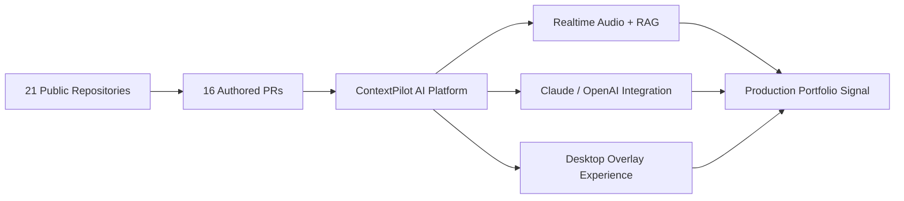
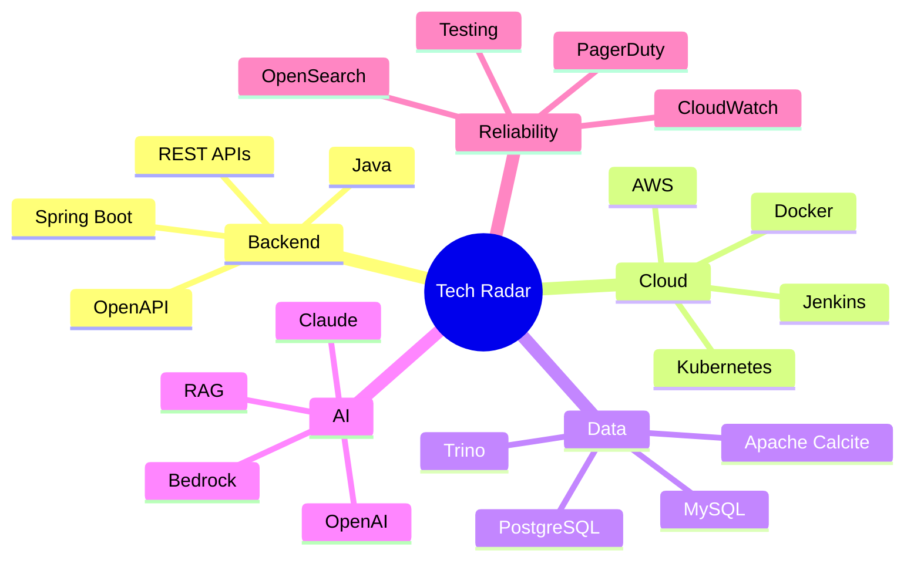
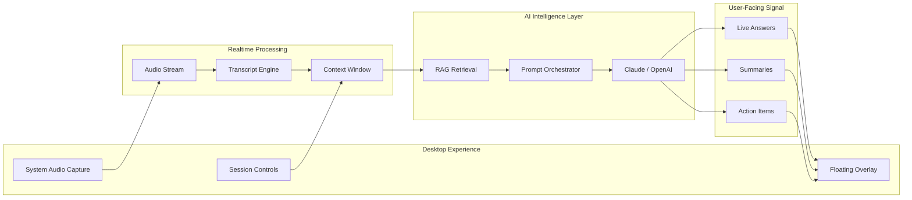

<!-- ============================================================ -->
<!--                  PREMIUM GITHUB PROFILE README               -->
<!-- ============================================================ -->

  

  

  
  
  
  

<table>
  <tr>
    <td align="center" width="25%"> Rapid7</td>
    <td align="center" width="25%"> backend and production systems</td>
    <td align="center" width="25%"> Claude, OpenAI, Bedrock, AWS</td>
    <td align="center" width="25%"> open to strong engineering teams</td>
  </tr>
</table>

---

## Professional Snapshot

<table>
  <tr>
    <td width="25%" align="center"><strong>Backend Platforms</strong> Java, Spring Boot, REST, OpenAPI</td>
    <td width="25%" align="center"><strong>Distributed Systems</strong> Kafka, microservices, event flows</td>
    <td width="25%" align="center"><strong>Cloud Engineering</strong> AWS, Docker, Kubernetes, CI/CD</td>
    <td width="25%" align="center"><strong>AI Engineering</strong> Claude, OpenAI, Bedrock, RAG</td>
  </tr>
</table>

---

## GitHub Analytics Command Center

  

  
  
  
  

<table>
  <tr>
    <td align="center" width="25%">
       
      last 12 months
    </td>
    <td align="center" width="25%">
       
      recent consistency
    </td>
    <td align="center" width="25%">
       
      best activity run
    </td>
    <td align="center" width="25%">
       
      GitHub history
    </td>
  </tr>
</table>

<strong>Contribution Heatmap</strong>

 

  

<strong>Contribution Histogram and Streak Graph</strong>

 

<table>
  <tr>
    <td align="center" width="60%">
      
    </td>
    <td align="center" width="40%">
      
    </td>
  </tr>
</table>

<strong>Repository, PR and Project Graphs</strong>

 

<table>
  <tr>
    <td align="center" width="50%">
      
    </td>
    <td align="center" width="50%">
      
        
      
      
      
      
    </td>
  </tr>
</table>

<strong>Repository Health Matrix</strong>

 

<table>
  <tr>
    <td width="50%" valign="top">
      <h3>ContextPilot</h3>
      
        
      
      
      
    </td>
    <td width="50%" valign="top">
      <h3>Angular + Spring Boot App</h3>
      
        
      
      
      
    </td>
  </tr>
</table>

---

## Tech Radar

  

<table>
  <tr>
    <td align="center" width="20%"> Java, Spring Boot, Quarkus</td>
    <td align="center" width="20%"> AWS, Kubernetes, Docker</td>
    <td align="center" width="20%"> Kafka, SQS, SNS</td>
    <td align="center" width="20%"> Claude, OpenAI, Bedrock</td>
    <td align="center" width="20%"> CloudWatch, OpenSearch, Trino</td>
  </tr>
</table>

<strong>Stack Signal</strong>

 

---

## ContextPilot Architecture

  
  
  

<table>
  <tr>
    <td align="center" width="25%"><strong>Live Audio</strong> capture pipeline</td>
    <td align="center" width="25%"><strong>Realtime AI</strong> Claude / OpenAI</td>
    <td align="center" width="25%"><strong>RAG Layer</strong> context retrieval</td>
    <td align="center" width="25%"><strong>Overlay UX</strong> low-friction assist</td>
  </tr>
</table>

---

## Professional Experience

<table>
  <tr>
    <td width="33%" valign="top">
      <h3>Rapid7</h3>
      <strong>Software Engineer II</strong> 
      Sep 2025 - Present  
      
      
      
    </td>
    <td width="33%" valign="top">
      <h3>Rockwell Automation</h3>
      <strong>Software Engineer</strong> 
      Jul 2023 - Sep 2025  
      
      
      
    </td>
    <td width="33%" valign="top">
      <h3>SDK Infotech</h3>
      <strong>Associate Software Engineer</strong> 
      Jun 2022 - Jul 2023  
      
      
      
    </td>
  </tr>
</table>

---

## Currently Exploring

  
  
  
  
  

---

## Education and Certifications

| Type | Details |
|---|---|
| B.Tech, Computer Engineering | Savitribai Phule Pune University - CGPA 9.21/10 - 2023 |
| Diploma, Information Technology | MSBTE - 91.81% - 2020 |
| Microsoft Technology Associate | Database Administration |
| In Progress | AWS Certified Solutions Architect - Associate SAA-C03 |

---

## Let's Connect

  
  
  

  

